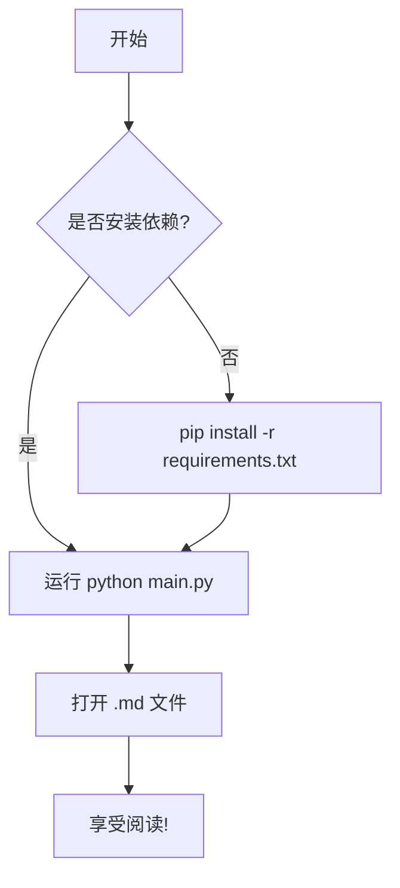
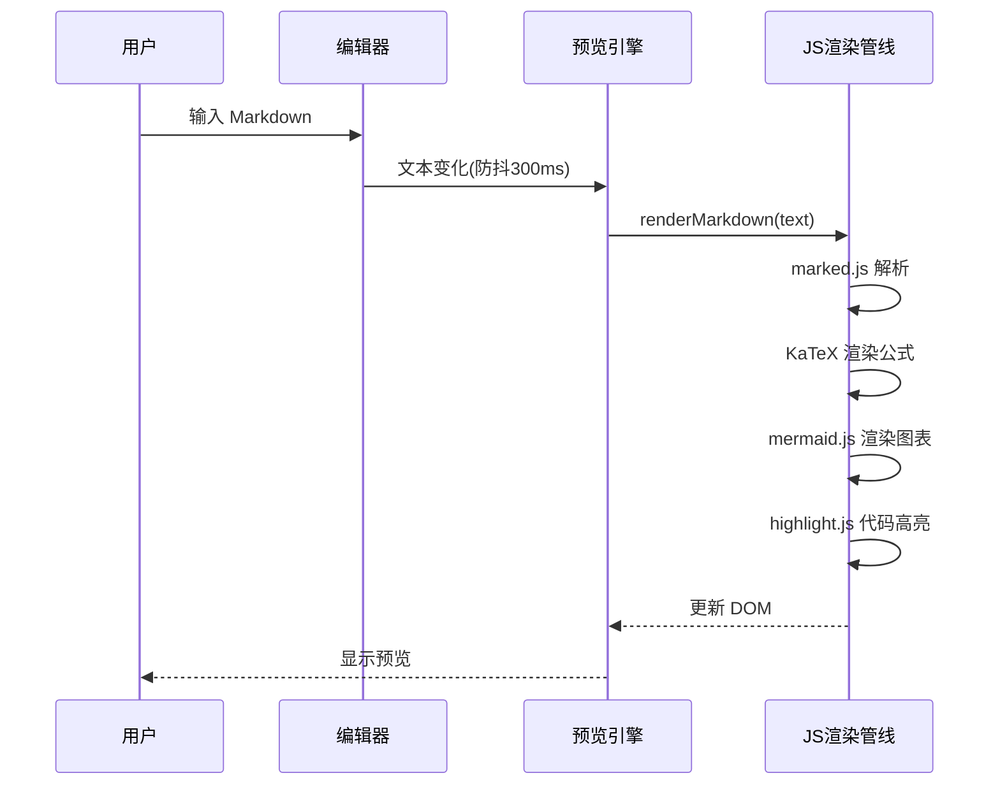
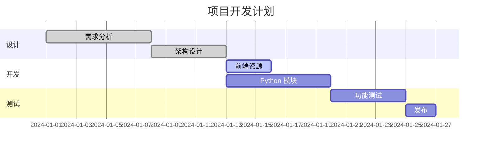

# MD Reader 功能演示

这是一个用于测试 MD Reader 所有功能的示例文档。

## 文本格式

这是 **粗体文本**，这是 *斜体文本*，这是 `行内代码`。

这是一个 [链接示例](https://github.com)。

> 这是一段引用文字。
> 可以有多行。

---

## 列表

### 无序列表
- 第一项
- 第二项
  - 嵌套项 A
  - 嵌套项 B
- 第三项

### 有序列表
1. 步骤一
2. 步骤二
3. 步骤三

### 任务列表
- [x] 已完成的任务
- [ ] 待完成的任务
- [ ] 另一个待办

## 代码高亮

```python
def fibonacci(n: int) -> list[int]:
    """生成斐波那契数列"""
    fib = [0, 1]
    for i in range(2, n):
        fib.append(fib[i - 1] + fib[i - 2])
    return fib[:n]

print(fibonacci(10))
```

```javascript
const greet = (name) => {
    console.log(`Hello, ${name}!`);
};
greet("MD Reader");
```

## LaTeX 公式

行内公式：质能方程 $E = mc^2$，欧拉公式 $e^{i\pi} + 1 = 0$。

块级公式：

$$
\int_{-\infty}^{\infty} e^{-x^2} dx = \sqrt{\pi}
$$

$$
\sum_{n=1}^{\infty} \frac{1}{n^2} = \frac{\pi^2}{6}
$$

矩阵：

$$
\begin{pmatrix}
a_{11} & a_{12} \\
a_{21} & a_{22}
\end{pmatrix}
\begin{pmatrix}
x_1 \\
x_2
\end{pmatrix}
=
\begin{pmatrix}
b_1 \\
b_2
\end{pmatrix}
$$

## Mermaid 图表

### 流程图



### 时序图



### 甘特图



## 表格

| 功能 | 状态 | 优先级 |
|------|------|--------|
| 双栏编辑+预览 | ✅ 完成 | P0 |
| LaTeX 公式 | ✅ 完成 | P0 |
| Mermaid 图表 | ✅ 完成 | P0 |
| 代码高亮 | ✅ 完成 | P0 |
| 文件树 | ✅ 完成 | P1 |
| TOC 导航 | ✅ 完成 | P1 |
| 多标签页 | ✅ 完成 | P1 |
| 深色模式 | ✅ 完成 | P2 |
| 导出 HTML/PDF | ✅ 完成 | P2 |

## 图片

（此处可插入本地或网络图片）


---

*由 MD Reader 渲染 — 基于 PyQt5 + QWebEngineView*
